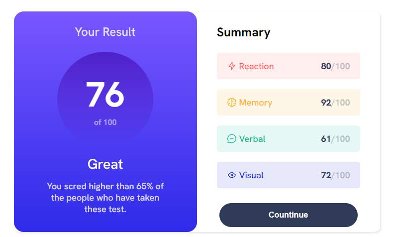
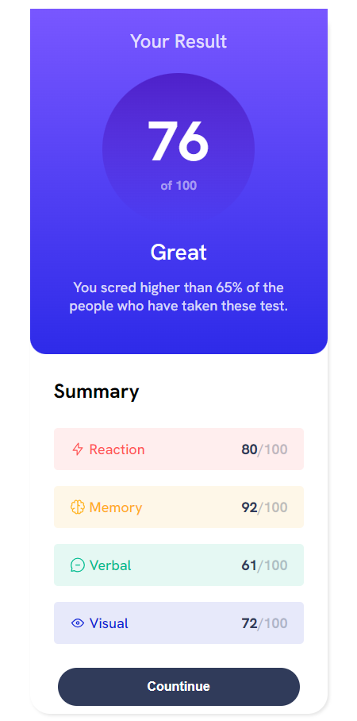

# Frontend Mentor - Results summary component solution

This is a solution to the [Results summary component challenge on Frontend Mentor](https://www.frontendmentor.io/challenges/results-summary-component-CE_K6s0maV). Frontend Mentor challenges help you improve your coding skills by building realistic projects. 

## Table of contents

- [Frontend Mentor - Results summary component solution](#frontend-mentor---results-summary-component-solution)
  - [Table of contents](#table-of-contents)
  - [Overview](#overview)
    - [The challenge](#the-challenge)
    - [Screenshot](#screenshot)
    - [Links](#links)
  - [My process](#my-process)
    - [Built with](#built-with)
    - [What I learned](#what-i-learned)
    - [Continued development](#continued-development)
  - [Author](#author)

## Overview

### The challenge

Users should be able to:

- View the optimal layout for the interface depending on their device's screen size
- See hover and focus states for all interactive elements on the page

### Screenshot





### Links

- Solution URL: [Add solution URL here](https://your-solution-url.com)
- Live Site URL: [Add live site URL here](https://your-live-site-url.com)

## My process

### Built with

- Semantic HTML5 markup
- CSS custom properties
- Flexbox
- Mobile-first workflow and desktop


### What I learned

In this project, I repeated the basics of using Flexbox. I tried to write a clean script. I would like to pay attention to whether I used margins and paddings correctly. I tried not to write width and height statically. I would like to know some recommendations on how to improve.


```html
<h1>Some HTML code I'm proud of</h1>
```
```css
.result{
  flex: 1;
  background: linear-gradient(to bottom, hsl(252, 100%, 67%), hsl(241, 81%, 54%));
  display: flex;
  flex-direction: column;
  align-items: center;
  border-radius: 20px;
}
.title-result{
  color:  hsla(0, 0%, 100%, 0.8);
  font-size: 24px;
  padding: 25px 0px;
}
.progress{
  background: linear-gradient(to bottom, hsl(256, 72%, 46%, 1), hsl(241, 72%, 46%, 0));
  padding: 40px 57px;
  border-radius: 50%;
  display: flex;
  flex-direction: column;
  align-items: center;
}
.out-hundred{
  color:  hsl(0, 0%, 100%);
  font-size: 70px;
  font-weight: 700;
}
.hundred{
  color:  hsla(0, 0%, 100%, 0.5);
  font-size: 16px;
  font-weight: 700;
}
.mark{
  padding: 15px 0px;
  color:  hsl(0, 0%, 100%);
  font-size: 28px;
}
.information{
  padding: 0px 60px 35px 60px;
  color:  hsla(0, 0%, 100%, 0.8);
  text-align: center;
  font-size: 18px;
}

.summary{
  flex: 1;
}
.title-summary{
  margin: 25px 0px 25px 40px;
  font-weight: 700;
  font-size: 25px;
}

.list-indicators-btn{
  display: flex;
  flex-direction: column;
  justify-content: center;
  margin: 0px 40px;
}
.list-indicators li{
  display: flex;
  align-items: center;
  justify-content: space-between;
  padding: 15px 20px;
  border-radius: 5px;
  margin-bottom: 20px;
}
.img-title, .interest { 
  display: flex;
}
.img-title p{
  padding-left: 5px;
}

.list-indicators li p{
  font-size: 18px;
}

```

### Continued development

I want to write cleaner code as much as possible, to improve my knowledge in the field of front-end, so please give me feedback on my work.

## Author

- Frontend Mentor - [@yydem1](https://www.frontendmentor.io/profile/ydem1)

